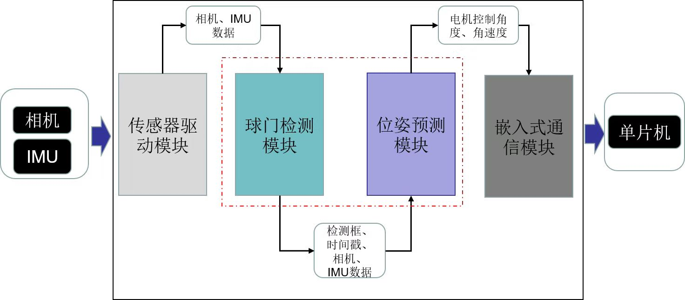

# 项目介绍


不同功能之间的通信是通过ROS中的发布者-订阅者的形式进行的。总共有以上四个线程，本仓库包含检测模块和预测模块的代码实现。

## 代码结构
```txt
├── CMakeLists.txt：编译文件
├── README.assets；存放 README.md 图片和附件
├── README.md：本文档
├── include头文件
│   ├── detector：球门检测模块头文件
│   ├── predictor：机器人位姿跟踪预测模块头文件
│   ├── common：数学库和基础函数的实现
│   ├── data_type：各模块使用数据类型
├── config
│   ├── camera-param.yml：相机参数文件，相机内参和相机IMU外参
│   ├── kalman_filter.yml：使用kalman滤波的方差设置
├── model存放训练好的模型
├── sample：每个模块类的接口使用示例
│   ├── sample_detector.cpp:检测类使用示例
│   ├── sample_predictor.cpp:跟踪与预测类使用示例
├── sample_data：测试数据
├── src源文件
│   ├── detector：球门检测模块代码实现
│   ├── predictor：机器人位姿跟踪预测模块代码实现
│   ├── common：数学库和基础函数的代码实现
```

## 项目依赖
```
+  CUDA
+ TensorRT
+  Ceres-Solver
+  OpenCV
+ Eigen
+ Ros melodic
```
## 编译使用
```bash
mkdir build
cd build
cmake ..
make
｀｀｀